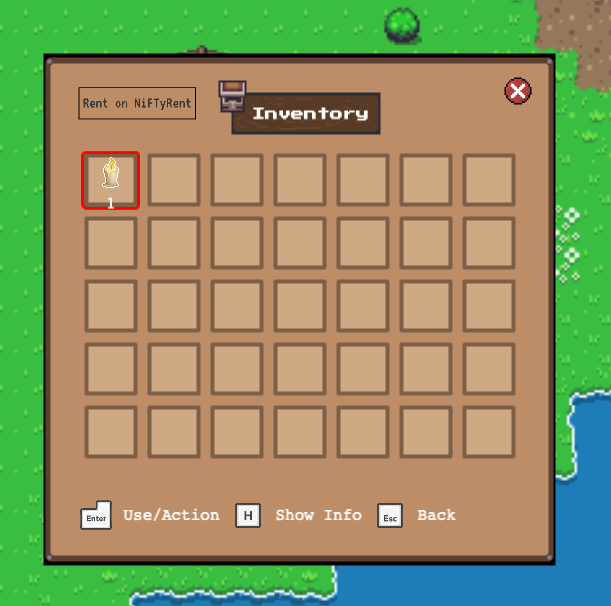

# Try out our demo RPG game!

Yes, we adapted a small [RPG game demo](#user-content-fn-1)[^1] to show how NFT rental could be integrated to a web app. And you can try it yourself!

Here is the link to the game that you can play in your browser:


[https://nifty-rpg.netlify.app/](https://nifty-rpg.netlify.app/)


### Login with NEAR

Once the game is loaded, first, you will see a login screen.&#x20;

 (1).png>)

Press "enter", then you will be redirected to the testnet NEAR wallet.

.png>)

After you selected the account you want to use and confirmed to connect, you will be redirected back to the game. And now you should see the option to start the game:

.png>)

### Play the game

You can use the arrow keys to move around, and use the space key to interact with object or attack enemies.

.png>)

You can click the chest icon on top right corner to see your inventory. You inventory should be empty now.

.png>)

There is cave on the cliff to east of where your character is spawned.

 (1).png>)

Go to the cave, and you should enter a dark dungeon. Without light, the dungeon is even more dangerous. Deadly monsters could be lurking at every corner 😱

.png>)

### Let's buy a candle

Go to our Nifty RPG NFT store on mintbase.io:


[https://testnet.mintbase.xyz/contract/niftyrpg.mintspace2.testnet/nfts/all/0](https://testnet.mintbase.xyz/contract/niftyrpg.mintspace2.testnet/nfts/all/0)


You can buy any of these candle NFT here (remember it's on testnet, so you pay with your "fake" NEAR money):

 (1).png>)

After you bought one candle NFT, reopen the inventory UI (or maybe reload the game). You will see a candle shows up!

And now if you go to the dungeon again, the candle will lit up the surrounding. You can see much further.

 (1).png>)

Now, go get some bats slashed! ⚔️

### Lend out your candle NFT

Maybe after a while, you have explored every inch of the dungeon, and have levelled up beyond it. Maybe you are up to some other quests, and the candle is not useful for you for now.

It would be a good idea if you can rent it to someone who needs it!

Go to the NiftyRent testnet app: [https://testnet.niftyrent.xyz/app](https://testnet.niftyrent.xyz/app), and sign in with your NEAR wallet. Then find the candle NFT in the "My NFTs" page. Clicking the Lend button will lead you to a UI for filling the details about the lease. (See more in [how-to-lend.md](how-to-lend.md "mention").)

.png>)

Once you submit your lease offer, people will able to see it in the Nifty RPG shop:

.png>)&#x20;

### Rent NFT without leaving the game!

Now let's we are a new player who haven't bought the candle NFT. (Maybe you also sign in the game with a different account.)

In the inventory UI, click the "Rent on NiFTyRent" button.

.png>)

And then you should see a in-game popup of the embedded NiFTyRent shopfront for this game, like below.

.png>)

Make sure you have signed in with the same account as for the game, and then pick one NFT to rent. The process is the same as we have covered in [how-to-borrow.md](how-to-borrow.md "mention").

After you successfully paid the rent to accept the lease, you close the embedded rental shop.

After the lease is accepted, it take effect immediately. Close the inventory tab and reopen it again, you will see the candle NFT item you just rented 🎉

.png>)

After the lease expires, the lender can claim the NFT back along with the rent. (See more in [how-to-collect-rents.md](how-to-collect-rents.md "mention").)

Thank you for time ❤️

[^1]: [https://github.com/SkyAlpha/luminus-rpg](https://github.com/SkyAlpha/luminus-rpg)
